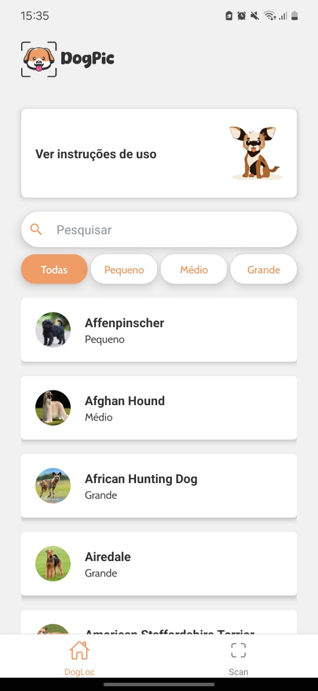
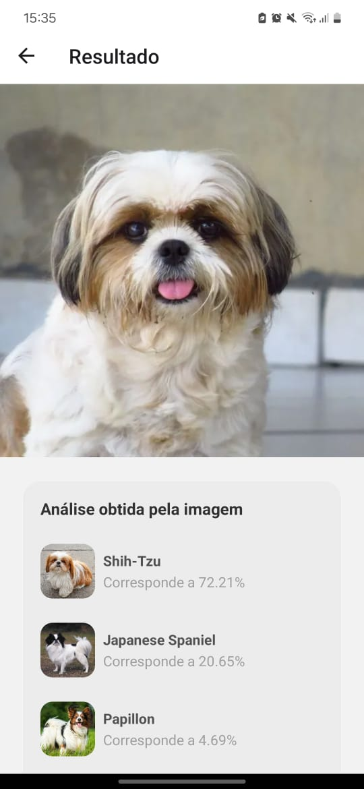

# DogPic
Projeto de finalização de curso

## Funcionalidades

- Buscar Raça de Cachorro: Permite ao usuário procurar informações detalhadas sobre diferentes raças de cães. A pesquisa pode ser feita por nome, ou pelo filtro através do porte do animal
- Exibir Detalhes da Raça de Cachorro: Apresenta uma visão completa da raça de cachorro selecionada, incluindo foto, características, necessidades de cuidados e saúde.
- Upload ou Captura de Foto para Identificação da(s) Raça(s): Oferece ao usuário a opção de carregar uma foto existente ou tirar uma nova foto do cachorro. Utiliza tecnologia de reconhecimento de imagem para identificar a raça e fornecer informações detalhadas sobre o animal.

  
  
  

## Ferramentas utilizadas

- Expo
- React Native
- Javascript
- Firebase
- Clarifai

## Abrir e rodar o projeto

Para executar o projeto é recomendado a utilização do aplicativo do Expo com suporte ao SDK 51, versões acima o projeto não será executado.

## Colaboradores

- Allison Alves
- João Pedro de Oliveira
- Kassya Beathrys
- Leonardo Casagrande
- Lucas Gabriel
